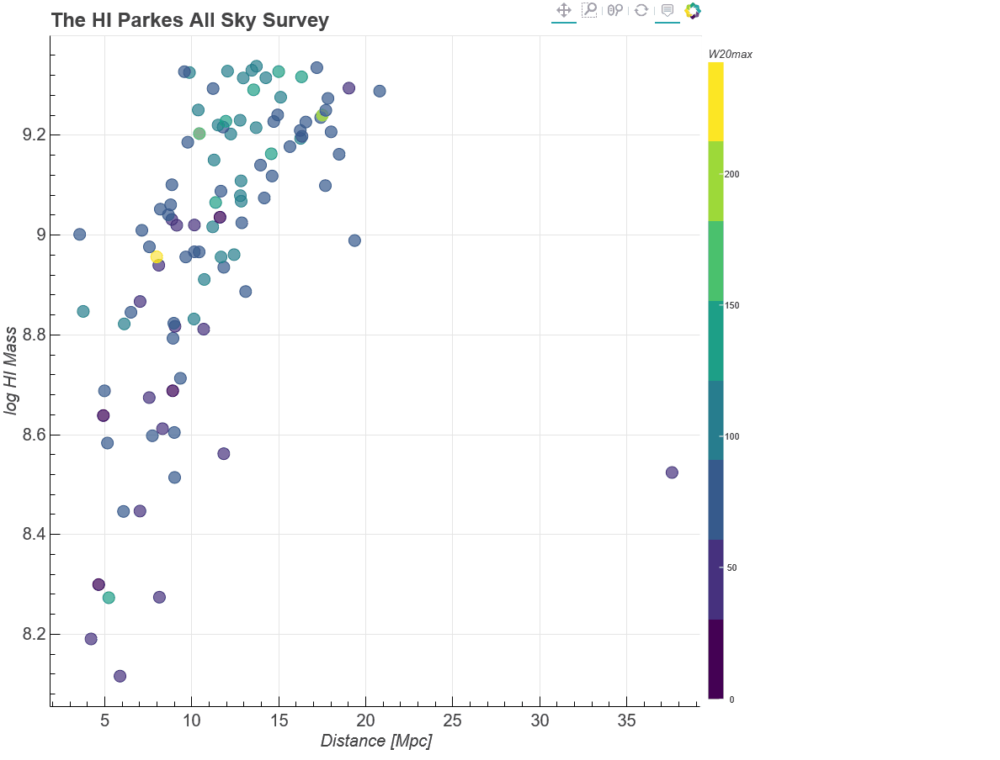

# datalab_project
Contributed notebook for datalab (https://datalab.noao.edu/). Jupyter notebook for interactive exploration of the HI Parkes All Sky Survey (HIPASS) data and multiwavelength visualization.

Example of the final result:

